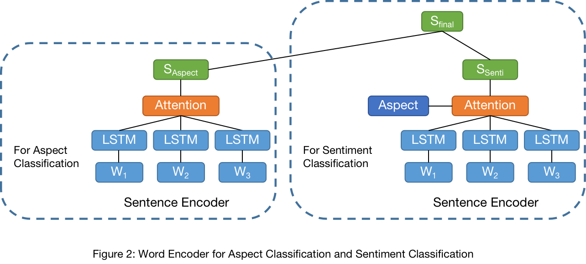
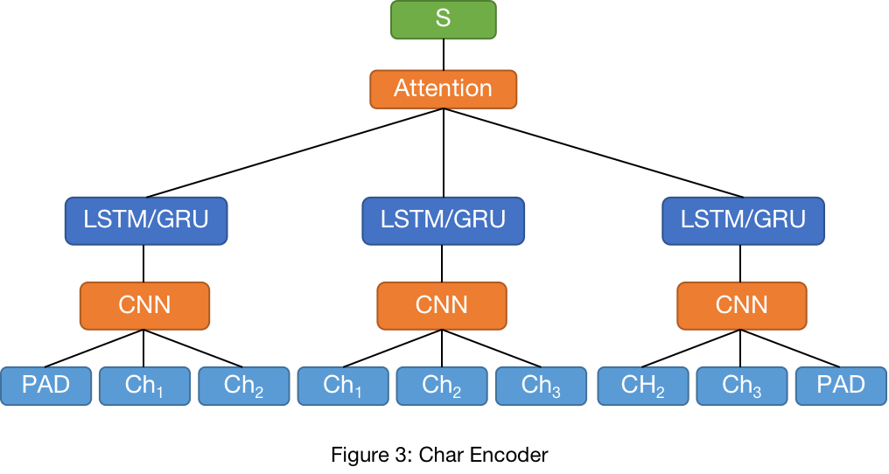
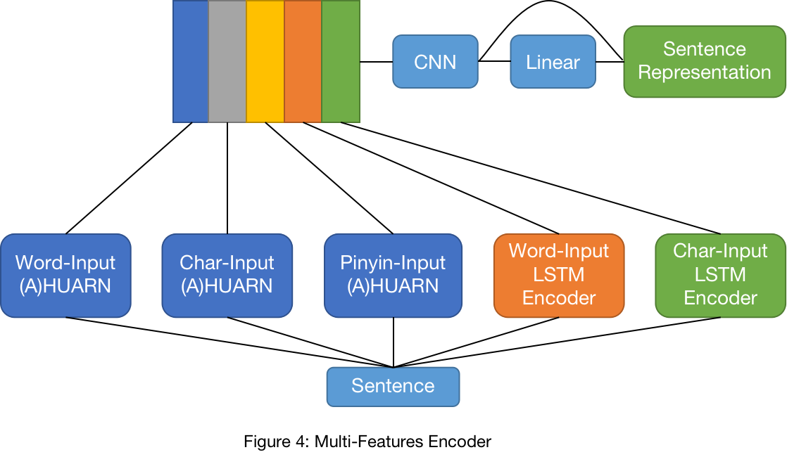
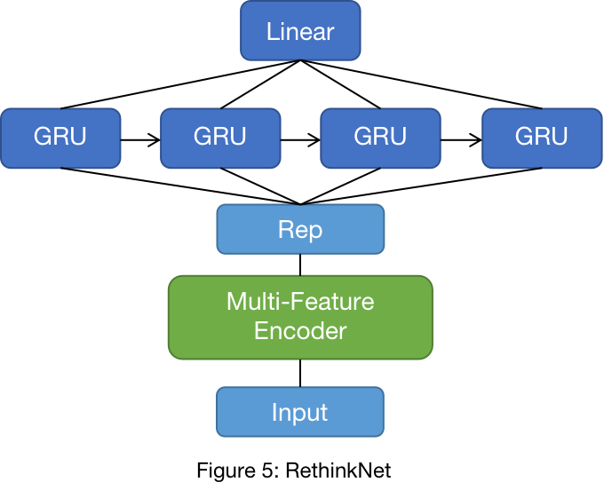
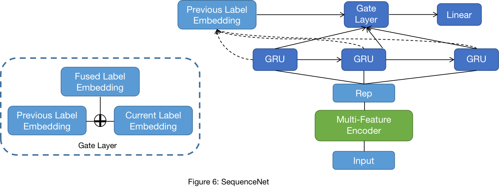

# System Description and Code for CCF-BDCI-2018-Car Reviews Sentiment Competition (汽车行业用户观点主题及情感识别)

## 0. Requirements
* Python 3.6
* Pytorch 1.0
* **!!THESE CODES MIGHT NOT BE RUNNABLE!!**

## 1. Task Description
CCF BDCI 2018 Car Reviews Sentiment Competition (汽车行业用户观点主题及情感识别)
[[Competition Details](https://www.datafountain.cn/competitions/310)]

Final Rank: 19/1701

#### 1.1 Aspect 10-Classes & Training Data Distribution
Power(动力), Price(价格), Interior(内饰), Configure(配置), Safety(安全性), Appearance(外观), Control(操控), Oil consumption(油耗), Space(空间), Comfort(舒适性)

| Power | Price | Interior | Configure | Safety | Appearance | Control | Oil consumption | Space | Comfort |
| :----: | :----: | :----: | :----: | :----: | :----: | :----: | :----: | :----: | :----: |
| 3454 | 1634 | 669 | 1075 | 736 | 606 | 1302 | 1379 | 535 | 1182 |

#### 1.2 Sentiment Training Data Distribution
| Positive | Neutral | Negative | Total |
| :----: | :----: | :----: | :----: |
| 2048 | 8488 | 2036 | 12572 |

#### 1.3 Two Stage Classification Task: Aspect Classification & Sentiment Classification
Predict Aspect->Aspect-based Sentiment Classification. Since each review might mention several aspects, aspect classification is a multi-label classification task.

#### Example:
>Chinese: 开过几个车，森(林人)是最费油的。
>
>English: I have driven several cars, and Forester is the **most gas-guzzling** car.
>
>Included Aspect & Sentiment:  Oil consumption-Negative
>
>Sentiment word: gas-guzzling (费油)

## 2. Method

### 2.1 Embedding & Corpus
We use the [LTP](http://www.ltp-cloud.com/) for word segmentation and [word2vec](https://code.google.com/archive/p/word2vec/) to train word embeddings. In order to reduce OOV, we collect car-related vocabulary from [Sogou Vocabulary](https://pinyin.sogou.com/dict/search/search_list/%C6%FB%B3%B5/upt-desc/). In addition, becuase this competition focuses on car reviews, we collect about 4,500,000 car-related reviews from [Tianya BBS (天涯论坛)](http://bbs.tianya.cn/list-cars-1.shtml) for embedding training.

### 2.1 Sentence Encoder

#### 2.1.1 Hierarchical Word-/Char-/Pinyin-based Sentence Encoder (Definition of [Pinyin](https://en.wikipedia.org/wiki/Pinyin))

In this system, we use three kinds of inputs for this hierarchical encoder, and they are word-input, char-input and pinyin-input which could partly reduce the effect of misspelling and introduce generalization. Because a single clause can express enough information for a aspect and its sentiment, we first use a GRU encoder to extract word-/char-/pinyin-features, then an attention layer is used to extract clause features (BiGRU-Attention Layer). Finally, we can get a sequence of clause features for each kind of input, so the BiGRU-Attention Layer is used again to select important information.

HUARN.png)

#### 2.1.2 Word-/Char-based Sentence Encoder

Besides hierarchical encoder, we also use simple sentence encoder to extract various features. 

* Word-Input (Figure 2)
	* Aspect Classification (AC): we only use a simple LSTM-Attention Layer to extract features.
	* Sentiment Classification (SC): besides the BiLSTM-Attention Layer used in AC, we also build a aspect-specific BiLSTM-Attention Layer to extract features.

* Char-Input (Figure 3): we first use CNN to extract local char context features, then we use BiLSTM/BiGRU-Attention Layer to extract global features.

#### 2.1.3 Multi-Features Encoder
In order to compromise all the extracted features, a convolutional layer is used to fuse these features in different perspective to get sentence representation. On top of this representation, we adopt a highway layer to get the final sentence representation (**Rep**).

### 2.2 Aspect Classification
In Aspect Classification, we use three neural networks for Aspect Classification (AspectNet, RethinkNet, and SequenceNet), which all use the same set of encoders (see Section 2.1).

**AspectNet:** AspectNet simply use a linear layer as decoder. 

**RethinkNet:** Inspired by [TODO], we first sort the label according to their sampley size in descending order, and then we duplicate the **Rep** n (n=10 in the experiments, where n is the total aspect number) times and form a sequence. Finally a single directional GRU layer is applied to this sequence (Figure 5).

**SequenceNet:** Inspired by [TODO], we treat this multi-label classification as a sequence labeling task, for there are some connections between different labels. To be specific, for each predicted label, we create a label embedding for it, and this label embedding will be used for the next label prediction. Furthermore, in order to select important information between previous label embedding and current label embedding, we introduce a gate layer (Figure 6).

### 2.3 Sentiment Classification
Similar to Aspect Classification, in Sentiment Classification, we use the same set of features and encoders plus the predicted aspects from Section 2.2 for each sentence.  

## Reference
1. Shuai Wang, Sahisnu Mazumder, Bing Liu, Mianwei Zhou, Yi Chang. 2018. Target-Sensitive Memory Networks for Aspect Sentiment Classification. In *Proceedings of ACL*.
2. Wei Xue and Tao Li. 2018. Aspect Based Sentiment Analysis with Gated Convolutional Networks. In *Proceedings of ACL*.
3. Ruidan He, Wee Sun Lee, Hwee Tou Ng, and Daniel Dahlmeier. 2018. Exploiting Document Knowledge for Aspect-level Sentiment Classification. In *Proceedings of ACL*.
4. Qiao Qian, Minlie Huang, Jinhao Lei, Xiaoyan Zhu. 2017. Linguistically Regularized LSTM for Sentiment Classification. In *Proceedings of ACL*.
5. Peng Chen, Zhongqian Sun, Lidong Bing, and Wei Yang. 2017. Recurrent Attention Network on Memory for Aspect Sentiment Analysis. In *Proceedings of EMNLP*.
6. Leyi Wang and Rui Xia. 2017. Sentiment Lexicon Construction with Representation Learning Based on Hierarchical Sentiment Supervision. In *Proceedings of EMNLP*.
7. Bjarke Felbo, Alan Mislove, Anders Søgaard, Iyad Rahwan, and Sune Lehmann. 2017. Using millions of emoji occurrences to learn any-domain representations for detecting sentiment, emotion and sarcasm. In *Proceedings of EMNLP*.
8. Shuqin Gu, Lipeng Zhang, Yuexian Hou and Yin Song. 2018. A Position-aware Bidirectional Attention Network for Aspect-level Sentiment Analysis. In *Proceedings of COLING*.
9. Devamanyu Hazarika, Soujanya Poria, Prateek Vij, Gangeshwar Krishnamurthy, Erik Cambria, and Roger Zimmermann. 2018. Modeling Inter-Aspect Dependencies for Aspect-Based Sentiment Analysis. In *Proceedings of NAACL*.
10. Fei Liu, Trevor Cohn, and Timothy Baldwin. 2018. Recurrent Entity Networks with Delayed Memory Update for Targeted Aspect-based Sentiment Analysis. In *Proceedings of NAACL*.
11. Jingjing Wang, Jie Li, Shoushan Li, Yangyang Kang, Min Zhang, Luo Si, and Guodong Zhou. 2018. Aspect Sentiment Classification with both Word-level and Clause-level Attention Networks. In *Proceedings of IJCAI*.
12. Yukun Ma, Haiyun Peng, Erik Cambria. 2018. Targeted Aspect-Based Sentiment Analysis via Embedding Commonsense Knowledge into an Attentive LSTM. In *Proceedings of AAAI*.
13. Zhen Wu, Xin-Yu Dai, Cunyan Yin, Shujian Huang, Jiajun Chen. 2018. Improving Review Representations with User Attention and Product Attention for Sentiment Classification. In *Proceedings of AAAI*.
14. Alon Rozental and Daniel Fleischer. 2018. Amobee at SemEval-2018 Task 1: GRU Neural Network with a CNN Attention Mechanism for Sentiment Classification. In *Proceedings of SemEval-2018*.
15. Chuhan Wu, Fangzhao Wu, Junxin Liu, Zhigang Yuan, Sixing Wu and Yongfeng Huang. 2018. THU NGN at SemEval-2018 Task 1: Fine-grained Tweet Sentiment Intensity Analysis with Attention CNN-LSTM. In *Proceedings of SemEval-2018*.
16. Yao-Yuan Yang, Yi-An Lin, Hong-Min Chu, and Hsuan-Tien Lin. 2018. Deep Learning with a Rethinking Structure for Multi-label Classification. *arXiv:1802.01697v1*.
